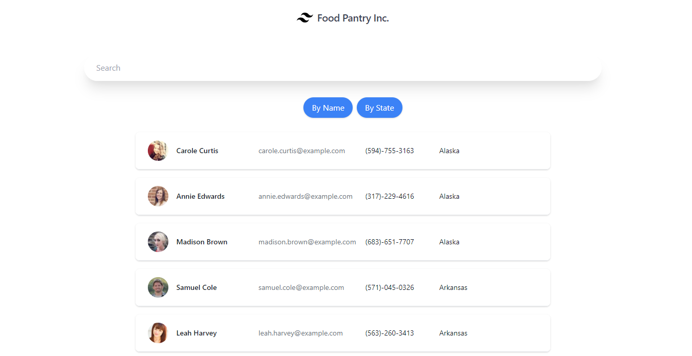

  # Employee Directory 

  
  ## Description
  This is an application to search in an employee directory and to filter by name and the State that the employee lives in. Made using React, Tailwinds, and Axios.  

  [View Project Here](https://jason-jorgensen.github.io/EmployeeDirectory/)

  ## Table of Contents

  * [Installation](#installation)
  * [Usage](#usage)
  * [License](#license)
  * [Contributing](#contributing)
  * [Tests](#tests)
  * [Questions](#questions)

  ## Installation

  npm i

  ## Usage

  npm start

  ## License

  This project is licensed under the MIT license.

  ## Questions
  If you have any questions please email me at jasoncjorgensen@gmail.com.

  Also, please see my [GitHub](https://github.com/Jason-Jorgensen)
